# 🐘MAMMOTH TRIP

여행지를 정하시려는데 축제, 맛집에 대해 궁금하신가요?

그렇다면 **MAMMOTH TRIP**👋👋

- 다양한 사람들의 추천을 받고 싶다면? **MAMMOTH TRIP!!!!**

- 여행지 주변 어떤 숙소, 축제 등이 있는지 궁금하다면? **MAMMOTH TRIP!!!!**

- 여행지를 정할 때 간단한 이상형 월드컵으로 현재 흥미를 확인하려면? **MAMMOTH TRIP!!!!**


# 🔨Using Teck Stack


## :triangular_ruler: ER-Diagram
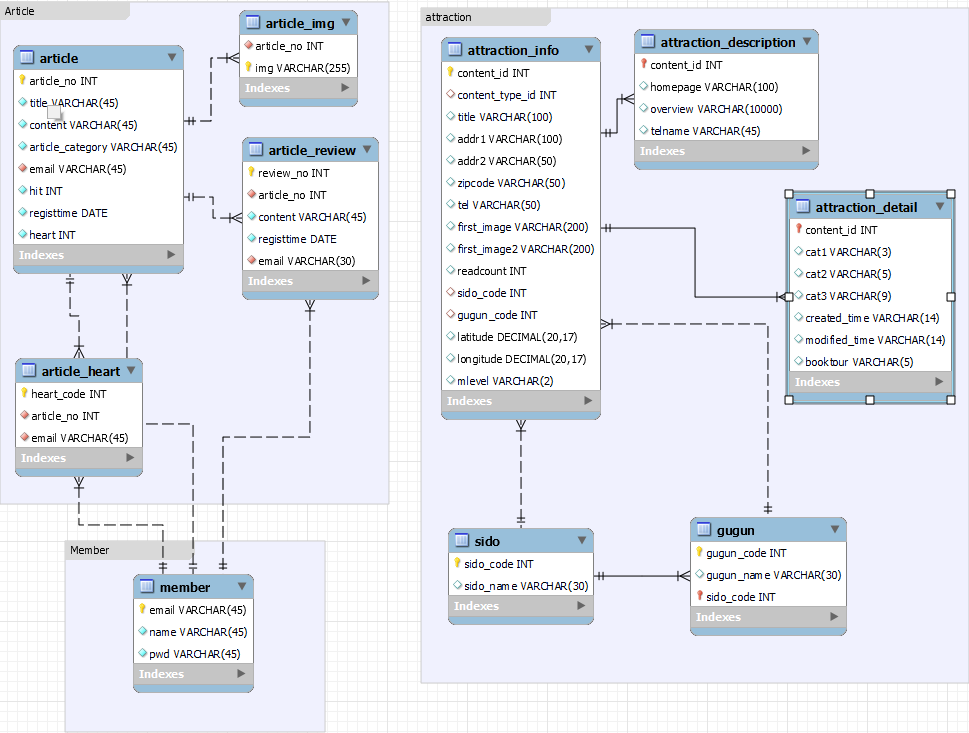

## 📢Web Function

 * KakaoMap API를 이용한 주변 축제, 숙박업소 찾기
 * 현재 흥미에 알맞은 여행지 찾는 이상형 월드컵
 * 다양한 사람들과 여행에 대한 커뮤니케이션을 위한 게시판

## 📷Using Screen

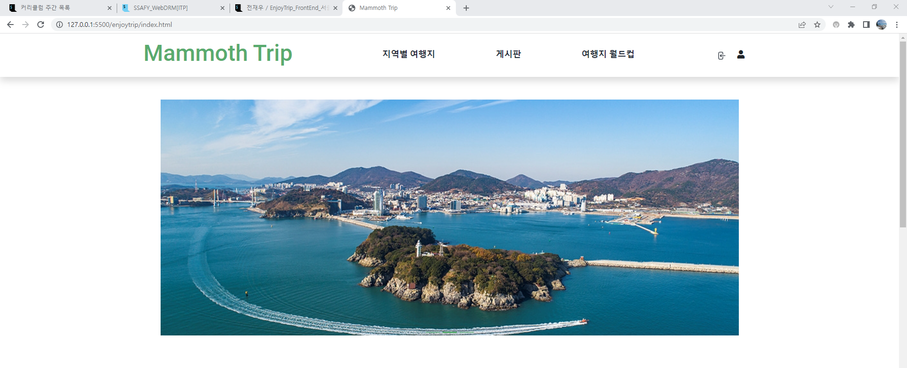
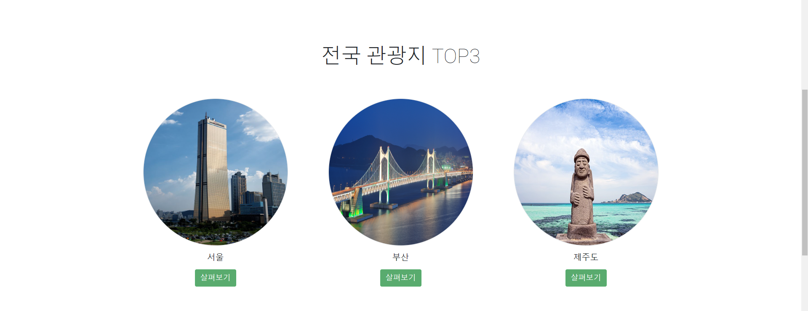
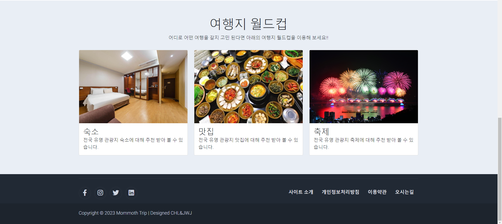
```
✨ 메인 페이지 구성요소
- 네비게이션 바 
- 커러셀
- 각 지역별 관광지 바로가기
- 유형별 이상형 월드컵 바로가기
```

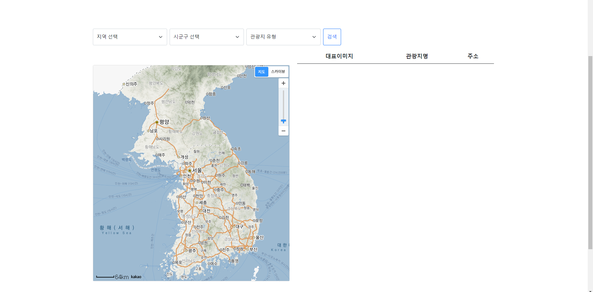
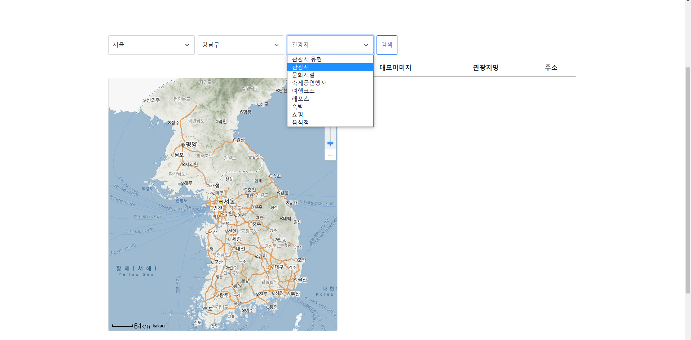
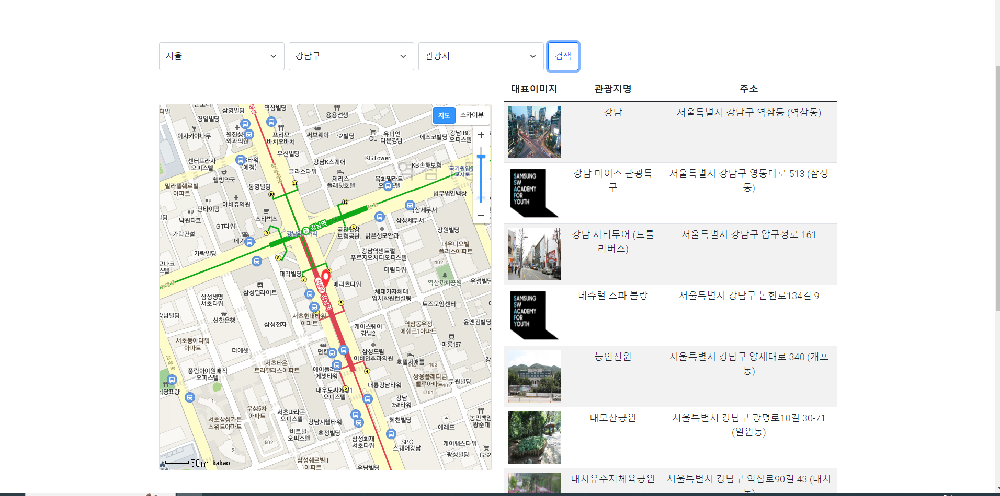
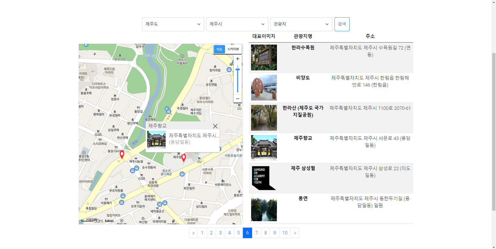
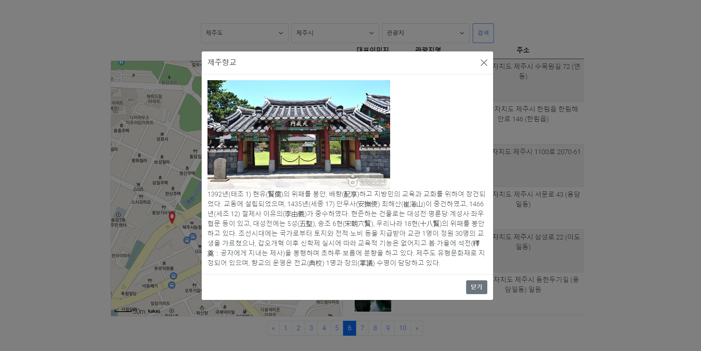
```
🎈지역별 관광지 페이지 구성요소
- 카카오맵 API 섹션
- 결과 출력 섹션
- 관광지 결과 개수에 따른 페이징 구현
- 각 장소별 마커 및 커스텀 오버레이 구현
- 커스텀 오버레이 클릭 시 상세 뷰 모달 구현

```
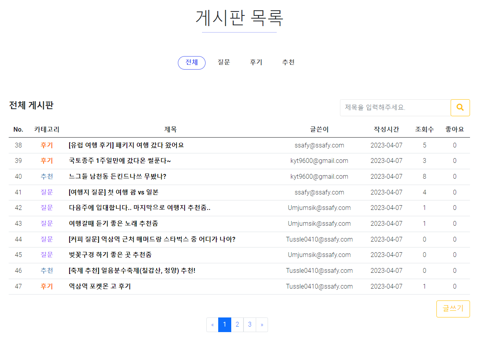

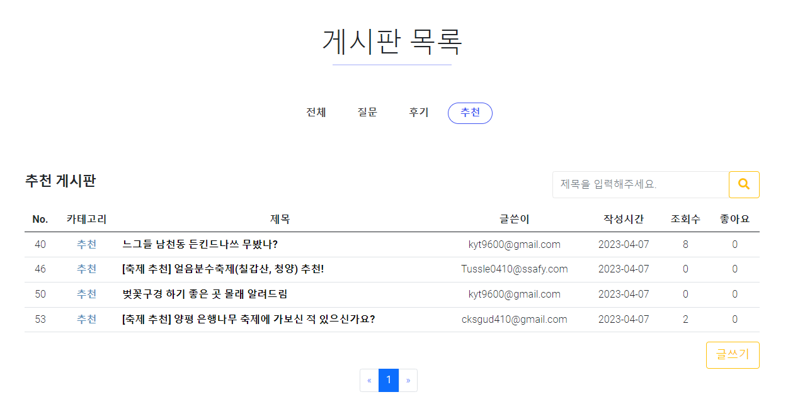
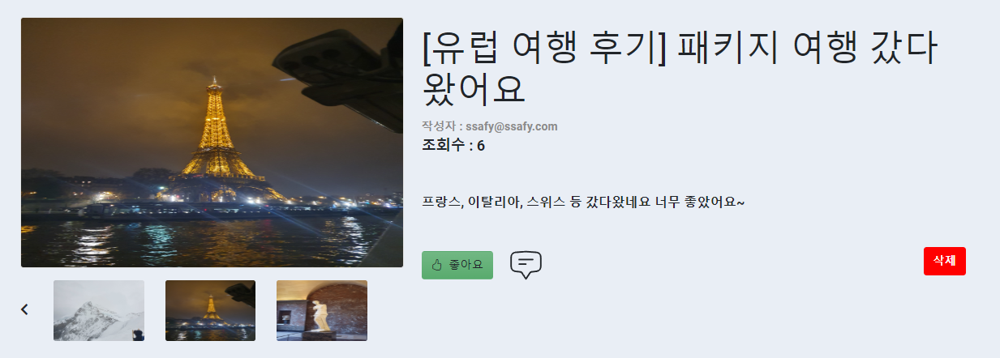
```
📃게시판 페이지 구성요소
- 유형 탭
- 게시글 리스트 테이블
- 검색 
- 글쓰기
- 사용자별 좋아요 표시
- 댓글 입력 및 리스트 
```

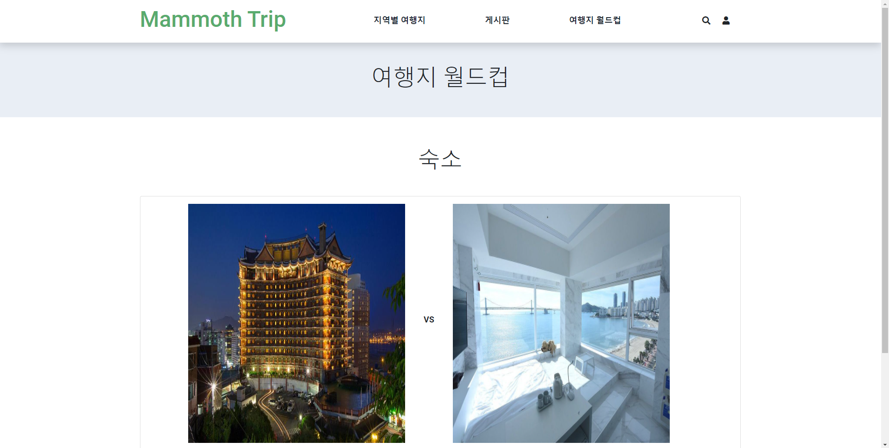
```
🏆이상형 월드컵 페이지 구성요소
- 이미지 2개 
```

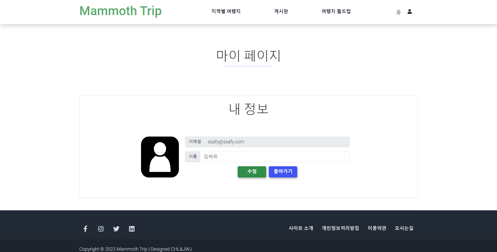
```
👦마이페이지 구성요소
- 프로필 사진
- 개인 정보 
```


## 🎓Studying Info

* ``HTML + CSS + Bootstrap``을  ``Web Screen``을 구현하는 방법을 학습하였습니다.
* ``JavaScript``을 이용하여 다양한 ``Event``를 처리하는 방법을 학습하였습니다.
* ``KakaoMap API``를 이용하여 주변 축제, 숙박업소 등을 마커, 탐색하는 방법을 학습하였습니다.
* ``LocalStorage``를 이용하여 내부 ``DB``처럼 활용하는 방법을 학습하였습니다.

...

## 👪참여자

😺 SSAFY 9기 전재우

👲 SSAFY 9기 이찬형


