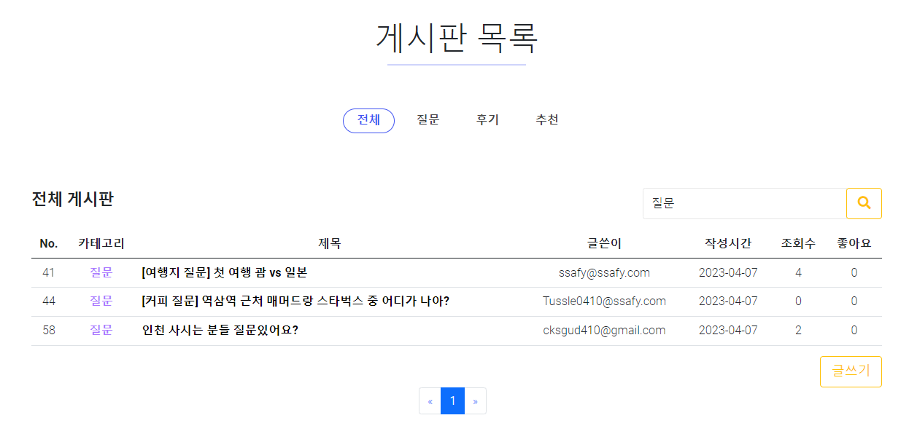
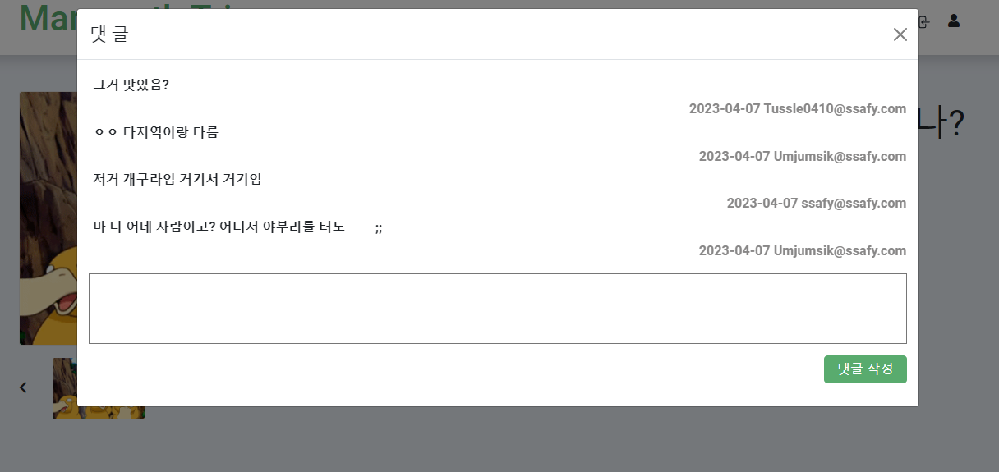
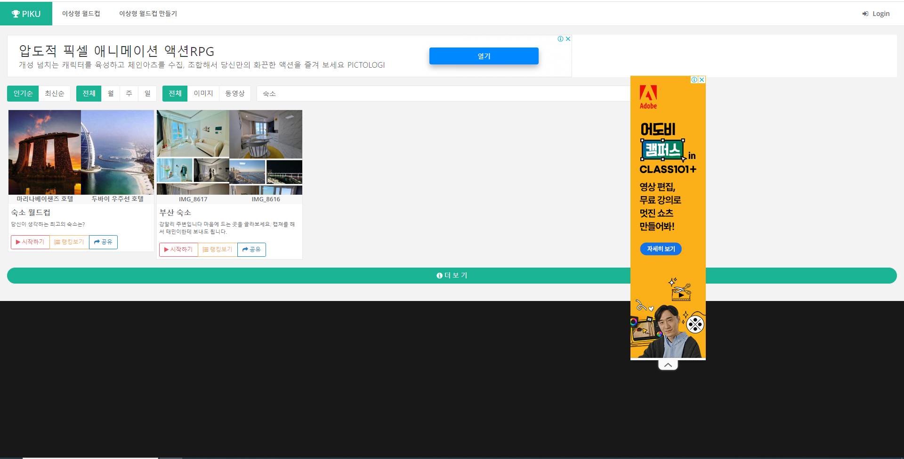

# 🐘MAMMOTH TRIP

여행지를 정하시려는데 축제, 맛집에 대해 궁금하신가요?

그렇다면 **MAMMOTH TRIP**👋👋

- 다양한 사람들의 추천을 받고 싶다면? **MAMMOTH TRIP!!!!**

- 여행지 주변 어떤 숙소, 축제 등이 있는지 궁금하다면? **MAMMOTH TRIP!!!!**

- 여행지를 정할 때 간단한 이상형 월드컵으로 현재 흥미를 확인하려면? **MAMMOTH TRIP!!!!**


# 🔨Using Teck Stack


## :triangular_ruler: ER-Diagram


```
💾 메인 페이지 구성요소
- Attraction : 를 이용한 주변 축제, 숙박업소 찾기
- Member : 현재 흥미에 알맞은 여행지 찾는 이상형 월드컵
- Board : 다양한 사람들과 여행에 대한 커뮤니케이션을 위한 게시판
```


## 📢Web Function

```
- KakaoMap API를 이용한 주변 축제, 숙박업소 찾기
- 현재 흥미에 알맞은 여행지 찾는 이상형 월드컵
- 다양한 사람들과 여행에 대한 커뮤니케이션을 위한 게시판
```


## 📷Using Screen


```
✨ 메인 페이지 구성요소
- 네비게이션 바(지역별 관광지, 게시판, 이상형 월드컵)
- 커러셀(Bootstrap)
- 각 지역별 관광지 바로가기(서울, 부산, 제주도)
- 유형별 이상형 월드컵 바로가기(축제, 숙박, 맛집)
```


```
🎈지역별 관광지 페이지 구성요소
- KakaoMap API
- 관광지 검색 결과 
- 관광지 결과 개수에 따른 페이징
- 각 장소별 마커 및 커스텀 오버레이
- 커스텀 오버레이 클릭 시 상세정보 모달

```


```
📃게시판 페이지 구성요소
- 유형 탭
- 게시글 리스트 테이블
- 키워드 검색 
- 게시글 작성
- 게시글 사용자별 좋아요 표시
- 댓글 입력 및 리스트 
- 이미지 업로드
```







```
🏆이상형 월드컵 페이지 구성요소
- 이상형 월드컵 검색
- 키워드 별 페이지 전환
```



```
👦마이페이지 구성요소
- 프로필 사진
- 개인 정보 
```


## 🎓Studying Info
```
🌕FrontEnd
- <HTML + CSS + Bootstrap>을  <Web Screen>을 구현하는 방법을 학습하였습니다.
- <JavaScript>을 이용하여 다양한 <Event>를 처리하는 방법을 학습하였습니다.
- <KakaoMap API>를 이용하여 주변 축제, 숙박업소 등을 마커, 탐색하는 방법을 학습하였습니다.
- <LocalStorage>를 이용하여 내부 <DB>처럼 활용하는 방법을 학습하였습니다.
```

```
🌑BackEnd
- <JSP + JSTL + JavaScriptlet>을  <Web Screen>을 구현하는 방법을 학습하였습니다.
- MVC패턴(Controller : Servlet, Model : Service, Dao, View : JSP) 을 학습하였습니다.
- <PaginationUtil>을 구현하여 지역별 여행지, 게시판에 , 숙박업소 등을 페이지를 제공할 수 있는 방법을 학습하였습니다.
- <Apachi Tomcat> 라이브러리를 이용하여 서버 로컬에 사용자들이 저장한 이미지들을 업로드하는 방법을 학습하였습니다.
- <MYSQL> 테이블 구성, 서브 쿼리, join 등 사용하는 방법을 학습하였습니다.
- <Redirect>, <forward>, <Rest-Api(fetch)>의 차이점 및 프로세스 과정을 자세하게 학습하였습니다.

```

## 👪참여자

😺 SSAFY 9기 전재우

👲 SSAFY 9기 이찬형


